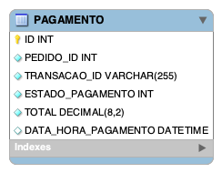

# Banco de Dados

## Banco de Dados escolhido

Inicialmente no projeto enquanto monolito, o tempo havia escolhido o MySQL como banco de dados para o projeto, mas quando houve uma migração para a nuvem suportada pela AWS Services, o MySQL foi substituído pelo Amazon Aurora MySQL, e agora com a implementação dos microsserviços optamos para usar o MongoDB que será usado na nuvem através do Amazon DocumentDB que é compatível com o MongoDB.

Essa decisão nos permitiu aproveitar as vantagens de se ter um banco de dados não relacionado, orientado a documentos, mais flexível, adequado ao ambiente de nuvem e fazendo com que a refatoração fosse a menor dentre os outros microsserviços.

Os motivos da escolha pelo MongoDB / Amazon DocumentDB estão detalhados abaixo, ressaltando que o termo MongoDB será utilizado para se referir a ambos, exceto na subseção que descreve a substituição do MySQL pelo Amazon DocumentDB.

### SGDB Não Relacional

Ao contrário do MySQL, o MongoDB não exige um esquema rígido predefinido. Isso significa que você pode adicionar campos aos documentos conforme necessário, proporcionando uma maior agilidade no desenvolvimento e evitando a necessidade de alterar esquemas existentes.

Para operações que envolvem leituras intensivas, o MongoDB pode oferecer desempenho superior, especialmente em consultas que aproveitam a estrutura de documentos aninhados sem a necessidade de juntas complicadas.

### Custo

O MongoDB oferece uma versão gratuita em nuvem através do MongoDB Atlas, o que condiz com o objetivo educacional do projeto.

### Familiariadade do time com o MongoDB

Apesar de sua popularidade, os membros da equipe não tinham bastante experiência com ele. E depois de pesquisar um pouco mais sobre banco de dados NoSQL, dentre algumas outras opções optamos pelo MongoDB uma vez que sua implementação e usabilidade eram mais familiares e declarativas.

### Substituição do MySQL pelo MongoDB/DocumentDB

A mudança foi solicitada pelos stakeholders, e o processo de substituição foi trabalhoso devido à falta de experiência com ele, porem o microsserviço de pagamento era menor, considerando que ele iria contemplar apenas a tabela de pagamento recebendo apenas o ID do pedido de forma externa. A implementação na AWS que foi mais trabalhada devido também à falta de experiência com o mesmo.

## Modelo de dados

### Diagrama



### Código DBML

```dbml
Documento "PAGAMENTO" {
  "ID" INT [pk, increment]
  "PEDIDO_ID" INT [not null]
  "TRANSACAO_ID" VARCHAR(255) [not null]
  "ESTADO_PAGAMENTO" INT [not null]
  "TOTAL" DECIMAL(8,2) [not null]
  "DATA_HORA_PAGAMENTO" DATETIME
}
```
